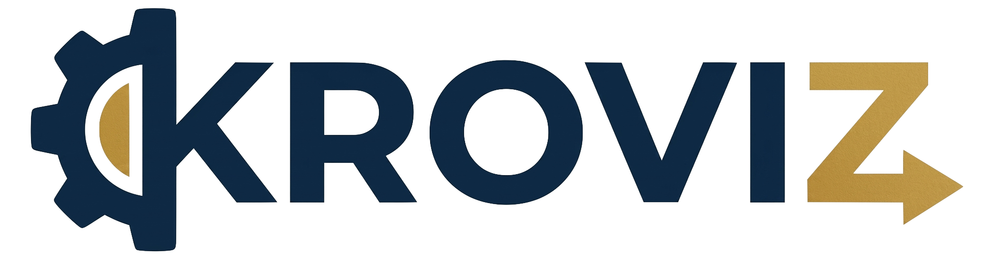

<div align="center">
  
  <p><strong>KRO ResourceGraphDefinition Visualizer</strong></p>
  
  [](https://opensource.org/licenses/Apache-2.0)
  [](https://nextjs.org/)
  [](https://tailwindcss.com/)
  [](https://reactflow.dev/)
</div>

KROViz is a production-grade, highly interactive visualizer and analytical engine for Kube Resource Orchestrator (KRO) `ResourceGraphDefinitions` (RGDs). 

Built with Next.js 15, TypeScript, TailwindCSS v4, React Flow, and ELK.js, KROViz parses Kubernetes RGDs, extracts complex CEL expression trees, infers implicit dependencies, and builds an execution directed acyclic graph (DAG) to determine reconciliation phases, identify critical path bottlenecks, simulate failures, and compute structural diffs between definitions.

---

## 🚀 Key Features

* **Bi-Directional Sync**: Editor-to-Graph and Graph-to-Editor sync. Moving your cursor in Monaco highlights the corresponding React Flow node, and clicking any node in the graph highlights and reveals the source code lines in Monaco.
* **Implicit Dependency Inference**: Infers dependencies from cross-resource references without requiring explicit fields.
* **Topological Execution Layers**: Schedules resources in parallel execution phases following topological sort rules, showing how KRO reconciles resources.
* **Failure Impact Simulation**: Click any node to fail it and trace propagation paths of cascading blockages across downstream dependents.
* **Structural Diffing**: Compare two RGD templates side-by-side with full schema changes, resource modifications, and dependency mutations.
* **Bottleneck Analysis**: Computes the longest execution path (critical path) weighted by estimated resource reconciliation durations, highlighting the primary pipeline bottleneck.

---

## 🛠️ Dependency Inference Rules

KRO has no explicit `dependsOn` field. All dependencies are inferred from `${...}` CEL expressions:
1. **CEL Reference Dependencies**: Simple cross-resource dot-paths (e.g. `${my-db.status.ip}`).
2. **Environment Variables**: Secret or ConfigMap name mappings injected dynamically.
3. **Volume Mounts**: Pod volumes loading dynamic ConfigMap/Secret names.
4. **Namespace References**: Resources declaring namespaced deployments referencing a namespace resource.
5. **Selector Matching**: Label selector matches parsed and inferred from the RGD schema.
6. **Conditionals**: `includeWhen` or `readyWhen` expressions referencing other resources.

---

## 📂 Project Architecture

```
src/
├── app/                          # Next.js App Router
│   ├── page.tsx                  # Main split-screen orchestration
│   ├── globals.css               # Theme & custom anims (Tailwind v4)
│   └── api/                      # REST endpoints for parser/validate/diff
├── engine/                       # Core engine layer
│   ├── parser/                   # YAML parser & CEL scanner
│   │   ├── cel-analyzer.ts       # CEL parser & normalizer
│   │   ├── rgd-parser.ts         # Resource loader & YAML tracker
│   │   └── schema-parser.ts      # SimpleSchema validation engine
│   ├── dependency/               # Inference engine
│   │   └── inference-engine.ts   # Context classifier
│   ├── graph/                    # DAG & analysis models
│   │   ├── dag.ts                # BFS/DFS traverser
│   │   ├── topological-sort.ts   # Layered scheduler
│   │   ├── critical-path.ts      # DP longest-path finder
│   │   ├── cycle-detector.ts     # Rotation-normalized loop finder
│   │   └── impact-analyzer.ts    # Cascading failure simulator
│   ├── diff/                     # Diff engine
│   │   └── rgd-differ.ts         # Structural diff engine
│   └── explain/                  # Natural language explainer
│       └── chain-explainer.ts    # Rationale generator
├── components/                   # React components
│   ├── layout/                   # SplitPane, Header, StatusBar
│   ├── editor/                   # Monaco wrapper & Sample selector
│   ├── graph/                    # React Flow & custom nodes/edges
│   ├── timeline/                 # Parallel column swimlane execution
│   └── panels/                   # Slideouts for Detail, Impact, & Diff
├── store/                        # Zustand app-store
└── hooks/                        # Custom hooks (sync, parser, ELK layout)
```

---

## ⚙️ Getting Started

### 1. Install Dependencies
```bash
npm install
```

### 2. Run the Development Server
```bash
npm run dev
```
Open [http://localhost:3000](http://localhost:3000) to access KROViz.

### 3. Run Production Build
```bash
npm run build
```

---

## 🧪 Automated Testing

KROViz has a comprehensive unit test suite powered by Vitest, testing every engine module:
* CEL expression parser & recursive walker
* Context-based dependency classifier
* Upstream/downstream subgraphs
* topologicalSort execution layers
* Longest critical path routing & bottleneck identifier
* Cycle loop detector & path rotation normalization
* Failure impact analysis & cascading severity ratio
* Resource, dependency, and schema structural differs

To run the automated tests:
```bash
npm test
```
